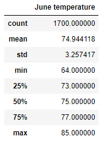

# Project Overview
Analysing weather data in Hawaii using SQLite database, and SQL alchemy, to help our client procure funding for starting a surf shop in Oahu!  

The purpose of the analysis is to look at June and December data in specific to understand if the business is sustainable all year-round.  
We use the automap function to reflect the tables and convert the relevant values into a list and subsequently a pandas dataframe which is easier to manipulate within python for analysis purposes.  

## Software used
- Jupyter notebook
- Dependencies
 - SQLAlchemy
 - Pandas
 - Numpy
 - Matplotlib

## Results
### June and December
The month of June results are below  
  
The month of December results are below  
  

Key differences between the two months
- Total number of values for June is higher than that of December (_count is 1700 vs 1517_)
  - This could mean that some stations don't report temperature data for December and this needs to be ivnestigated
- The Mean temperature and the median temperature have a difference of 4 degrees
- The Min temperature however is much lower in December, compared to June (_56 in Dec vs 64 in June_)
  - While this is to be expected, we need to investigate how many days in December have a minimum temperature below 64 in December to get a sense of cold days where people may not be willing to surf and eat ice-cream
- The standard deviation in December is also higher than June by 0.5

## Summary
From the above analysis we can see that the Surf shop is definitely an all-year business from a weather perspective, however there are other attributes of weather which we need to consider such as precipitation.   
### Additional query 1: Precipitation analysis for the two months
Running the two additional queries, we get the below results  

  

As we can see, the precipitation is definitely higher in December, this needs to be taken to revenue planning as we may have fewer days with revenue during December.  

Couple of other areas wehere we can investigate further are
- Number of days with lower than 64 degree temperature in December
- Number of stations reporting in December

